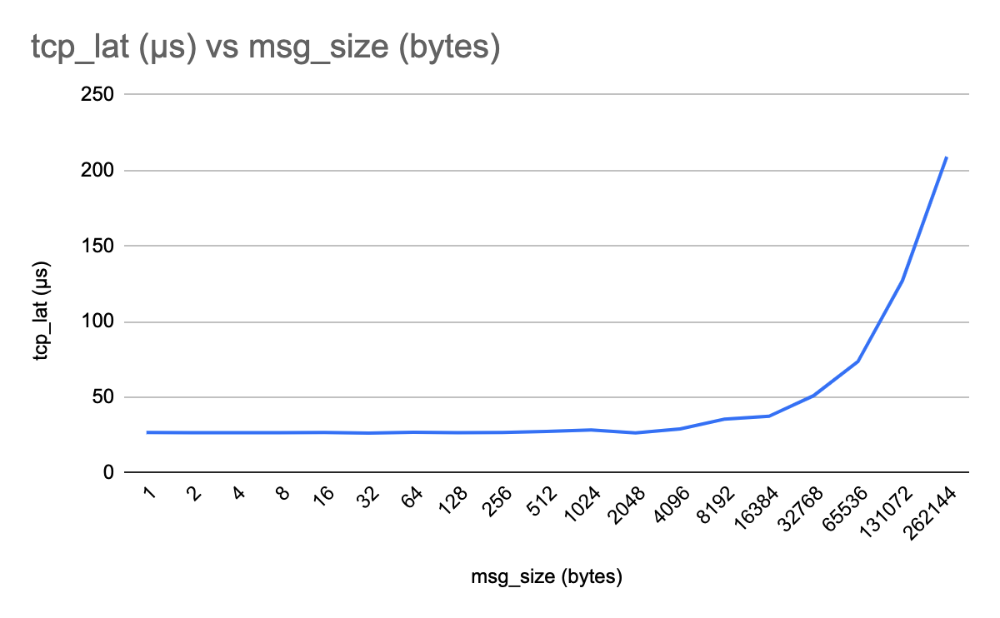

# Benchmarking RDMA
Here, we try to measure an RDMA network performance using **qperf** tool.

### Description
`qperf --help`

qperf measures bandwidth and latency between two nodes.  It can work over TCP/IP as well as the RDMA transports.  On one of the nodes, qperf is typically run with no arguments designating it the server node.  One may then run qperf on a client node to obtain measurements such as bandwidth, latency and cpu utilization.

In its most basic form, qperf is run on one node in server mode by invoking it with no arguments.  On the other node, it is run with two arguments: the name of the server node followed by the name of the test.  A list of tests can be found in the section, TESTS.  A variety of options may also be specified.

One can get more detailed information on qperf by using the `--help option`.  Below are examples of using the --help option:

```sh
qperf --help examples       Some examples of using qperf
qperf --help opts           Summary of options
qperf --help options        Description of options
qperf --help tests          Short summary and description of tests
qperf --help TESTNAME       More information on test TESTNAME
```

### `qperf --help examples`

In these examples, we first run qperf on a node called myserver in server mode by invoking it with no arguments.  In all the subsequent examples, we run qperf on another node and connect to the server which we assume has a hostname of myserver.

* To run a TCP bandwidth and latency test:
    `qperf myserver tcp_bw tcp_lat`
* To run a SDP bandwidth test for 10 seconds:
    `qperf myserver -t 10 sdp_bw`
* To run a UDP latency test and then cause the server to terminate:
    `qperf myserver udp_lat quit`
* To measure the RDMA UD (Unreliable Datagram) latency and bandwidth:
    `qperf myserver ud_lat ud_bw`
* To measure RDMA UC (Unreliable Connection) bi-directional bandwidth:
    `qperf myserver rc_bi_bw`
* To get a range of TCP latencies with a message size from 1 to 64K
    `qperf myserver -oo msg_size:1:64K:*2 -vu tcp_lat`

> [RDMA RC, UC, UD Explained](https://docs.nvidia.com/networking/display/rdmaawareprogrammingv17/transport+modes)

### Installation Steps
* qperf does not come pre-installed. But, it can be installed using
```sh
sudo apt install qperf
```

## EXPERIMENTS
> We'd be measuring network bandwidth (bw) and latency (lat).

### 1. TCP bw, lat | 1 client, 1 server
> Please note that we've performed a TCP test first.

Server: `qperf` (vm1 in our case)

Client: `qperf 192.168.122.72 tcp_bw tcp_lat` (vm2 in our case)

Result: (on vm2)
```sh
tcp_bw:
    bw  =  5.78 GB/sec
tcp_lat:
    latency  =  26.1 us
```

### 2. UDP bw, lat | 1 client, 1 server

Server: `qperf` (vm1 in our case)

Client: `qperf 192.168.122.72 udp_bw udp_lat` (vm2 in our case)

Result: (on vm2)
```sh
udp_bw:
    send_bw  =  846 MB/sec
    recv_bw  =  846 MB/sec
udp_lat:
    latency  =  25.8 us
```

### 3. Range of TCP latencies wrt varying message sizes


[Link for Raw Data Values Used](https://docs.google.com/spreadsheets/d/1c8y4eYEd8_1H9NEOP8XKVsrGGHft05RXx2_fa179Uqo/edit?gid=0#gid=0)

### 4. RDMA Send/Receive bw, lat | 1 client, 1 server
Server: `qperf` (vm1 in our case)

Client: `qperf 192.168.122.72 rc_bi_bw rc_lat -cm On -cp1 On -i rxe0:19765` (vm2 in our case)
> I tried several other combinations of options apart from the one mentioned above, but couldn't somehow get the results out. I could see the connection getting established (as both the server and the client reported the same error) but data transfer didn't take place. 

Result (Error): (on vm1)
```sh
vm1@vm1:~$ qperf
failed to modify QP to RTR: Invalid argument
```

Result (Error): (on vm2)
```sh
failed to modify QP to RTR: Invalid argument
server: failed to modify QP to RTR: Invalid argument
```

> RTR stands for Ready to Receive and is a state in which a QP enters during its lifetime. More information [here](https://www.rdmamojo.com/2012/05/05/qp-state-machine/)